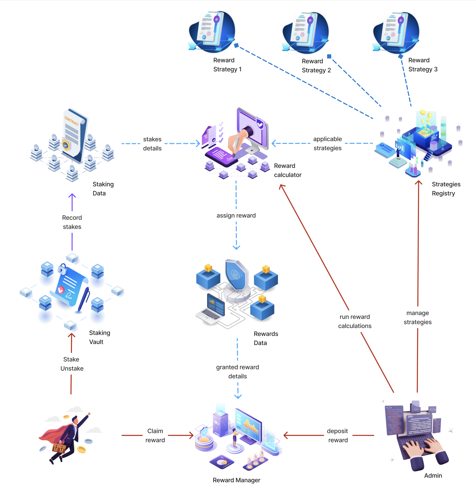

# Token Staking System

A secure, flexible staking platform for tokens with time-locked commitments and comprehensive reward mechanisms.

## 🚀 Quick Start

**New to staking?** Start here:

- 📖 **[User Guide](docs/user_docs.md)** - Learn what staking is and how to get started
- 🎁 **[Rewards Guide](docs/rewards_guide.md)** - Understand how rewards work (coming soon)

**Developer or auditor?** Technical documentation:

- 🏗️ **[Architecture Overview](docs/architecture_overview.md)** - System design and architecture
- 📋 **[Contract Specifications](docs/contract_specifications.md)** - Detailed technical specs
- 🔧 **[Deployment Guide](audit/deployment_guide.md)** - Setup, testing, and deployment
- 🔐 **[Security Roles](audit/roles.md)** - Access control and permissions

## 📚 Documentation Structure

### For Users

| Document                                       | Purpose                                              | Audience                               |
| ---------------------------------------------- | ---------------------------------------------------- | -------------------------------------- |
| [User Guide](docs/user_docs.md)                | Basic staking concepts and step-by-step instructions | New web3 users                         |
| [Checkpoints Guide](docs/checkpoints_guide.md) | How your staking history is tracked for fair rewards | Users wanting to understand the system |
| [Rewards Guide](docs/rewards_guide.md)         | Complete rewards system explanation                  | All users interested in earning        |

### For Developers & Auditors

| Document                                                   | Purpose                                     | Audience             |
| ---------------------------------------------------------- | ------------------------------------------- | -------------------- |
| [Architecture Overview](docs/architecture_overview.md)     | System design and architecture overview     | Developers, auditors |
| [Contract Specifications](docs/contract_specifications.md) | Detailed technical specifications           | Developers, auditors |
| [Deployment Guide](audit/deployment_guide.md)              | Setup, testing, and deployment instructions | DevOps, developers   |
| [Security Roles](audit/roles.md)                           | Access control system and role definitions  | Security auditors    |
| [Use Cases](audit/use_cases.md)                            | Functional requirements and user scenarios  | QA, auditors         |
| [Test Cases](audit/test_cases.md)                          | Comprehensive test scenarios                | QA engineers         |
| [Test Coverage Matrix](audit/test_coverage_matrix.md)      | Requirements to test mapping                | Auditors, QA         |

## ✨ What Makes This Special

### 🔒 **Security First**

- Multi-layered security with role-based access control
- Time lock enforcement prevents premature withdrawals
- Battle-tested OpenZeppelin libraries
- Comprehensive audit documentation

### 📊 **Advanced Data Management**

- **Checkpoint System**: Automatic historical balance tracking
- **Binary Search Optimization**: O(log n) historical queries
- **Individual Stake Tracking**: Unique IDs with complete lifecycle data
- **Comprehensive Analytics**: Daily snapshots and global statistics
- **Batch Operations**: Gas-efficient bulk operations
- **Future-Proof Storage**: Ready for complex reward calculations

### 🎯 **User Focused**

- Flexible time lock periods (including no lock)
- Multiple stakes per user
- Clear documentation for all experience levels
- Integration with external claiming systems

### 🏗️ **Developer Friendly**

- **Modular Architecture**: Clear separation between logic and storage
- **Comprehensive Interfaces**: Well-defined contract interfaces
- **Gas Optimized**: Efficient data structures and operations
- **Extensive Documentation**: Complete technical specifications
- **Integration Ready**: Built for ecosystem expansion

## 🔗 Live Deployments

### Sepolia Testnet

- **StakingVault**: [0x5B9801ab239F07B75BffACF7e82DB05D01a1D763](https://sepolia.etherscan.io/address/0x5B9801ab239F07B75BffACF7e82DB05D01a1D763/#code)
- **StakingStorage**: [0x6A1ECdc267e80346F7526Fa320b7a0c147093a17](https://sepolia.etherscan.io/address/0x6A1ECdc267e80346F7526Fa320b7a0c147093a17/#code)

## 🛠️ Technology Stack

- **Smart Contracts**: Solidity ^0.8.30
- **Testing Framework**: Foundry
- **Security Libraries**: OpenZeppelin
- **Architecture**: Modular design with separation of concerns

## 📋 Project Status

| Component                  | Status   | Description                                  |
| -------------------------- | -------- | -------------------------------------------- |
| ✅ **StakingVault**        | Complete | Main interface contract with business logic  |
| ✅ **StakingStorage**      | Complete | Data persistence with checkpoint system      |
| ✅ **Time Lock System**    | Complete | Flexible lock periods with enforcement       |
| ✅ **Historical Tracking** | Complete | Complete stake history with binary search    |
| ✅ **Security Framework**  | Complete | Multi-layer security with role-based access  |
| ✅ **Integration Support** | Complete | Claim contract integration and external APIs |
| 🚧 **Reward Calculator**   | Planned  | Reward computation engine                    |
| 🚧 **Reward Manager**      | Planned  | Reward distribution and claiming             |
| 🚧 **Strategy Registry**   | Planned  | Multiple reward strategies system            |

## 📄 License

This project is licensed under the MIT License - see the [LICENSE](LICENSE.md) file for details.

## 🔗 Links

- **External Requirements**: [Notion Requirements Doc](https://www.notion.so/futureverse/Claim-and-Staking-requirements-1d20cb4dab3d80a297b1e4364e4b25b3)
- **Token**: [Sepolia Contract](https://sepolia.etherscan.io/address/0x6e0b07E7A1B550D83E2f11C98Cf1E15fe2b8d47B#code)
- **Related Systems**: [Claiming Contract](https://sepolia.etherscan.io/address/0x0b9f301DB9cDA7C8B736927eF3E745De12b81581/#code)

---

**Need help?** Start with the [User Guide](docs/user_docs.md) or [Architecture Overview](docs/architecture_overview.md) depending on your needs.
